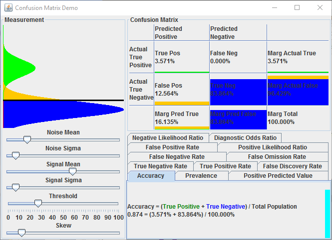

# Confusion Matrix Demo #

This is a Java demonstration of a Confusion Matrix and related concepts.

# Overview #

## Measurement ##

The left display represents the measurements space for a binary classification problem.  By binary classification, we simply mean making a hard decision based on some continuous measurement. For example, deciding a patient has prostate cancer based on a PSA test, or deciding some behavior is anomalous.

The lower bell curve represents the population where the condition is false, the upper bell curve represents the condition is true.  The horizontal black line represents the decision threshold.

Making a decision is an usually an imperfect process, some measurement values do not indication a condition clearly, we must balance the cost of an incorrect decision.

Try adjusting the sliders to vary the characteristics of the populations and decision threshold.

## Matrix ##

The right display shows a Confusion Matrix, which is a representation of our threshold decision in terms of correct and incorrect decisions.  This considers two factors, is the actual condition true, and did we predict the condition is true.  

- True Positive: We correctly predict the condition is true
- True Negative: We correctly predict the condition is false
- False Positive: We predict true, but the actual condition is false
- False Negative: We predict false, but the actual condition is true

Note how the populations on the left are divided into the buckets on the confusion matrix.

We would like a measurement that is so clear that we only see True Positive and True Negative.  Real data is rarely so accommodating.  We must balance the cost of our errors.

## Metrics ##

The bottom right display shows metrics based on the confusion matrix.  We would like to summarize the errors from the confusion matrix into a single number to evaluate our decision.  

One example is Accuracy. 

- Accuracy = Correct Decision / All Decisions

This is appealing, and common, metric, describing how often we make the correct decision.  A Pregnancy Test is described as being 99% accurate.

Accuracy works well with a common condition, but it works poorly with a rare condition.  

For example, what are the chances you will win the lottery today?  This would be an obviously useful test result, one could buy a mega-lottery ticket only if the test result is true.  Suppose the test result is simply, "no, you will not win the mega-lottery today", what would be the Accuracy?

- Accuracy > 99.99% / 100%

You can observe this effect by increasing the 'Skew' (the imbalance between the condition false and true.  Note that increasing the threshold does not significantly affect the Accuracy.

This doesn't mean that Accuracy is bad in general, but it works poorly with an imbalanced data set.

Accuracy is just one example of a metric, there are many ways of combining the data in the confusion matrix into a single number.  Use this tool to vary the parameters of of the distribution to gain an intuition of these metrics.

  

